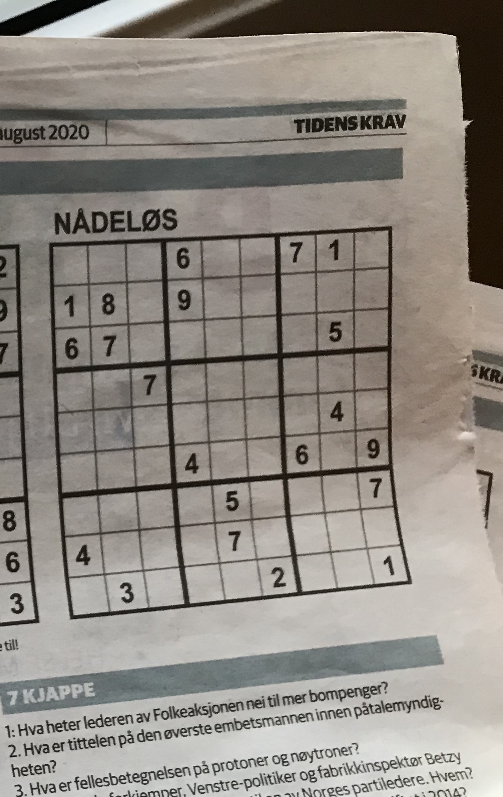
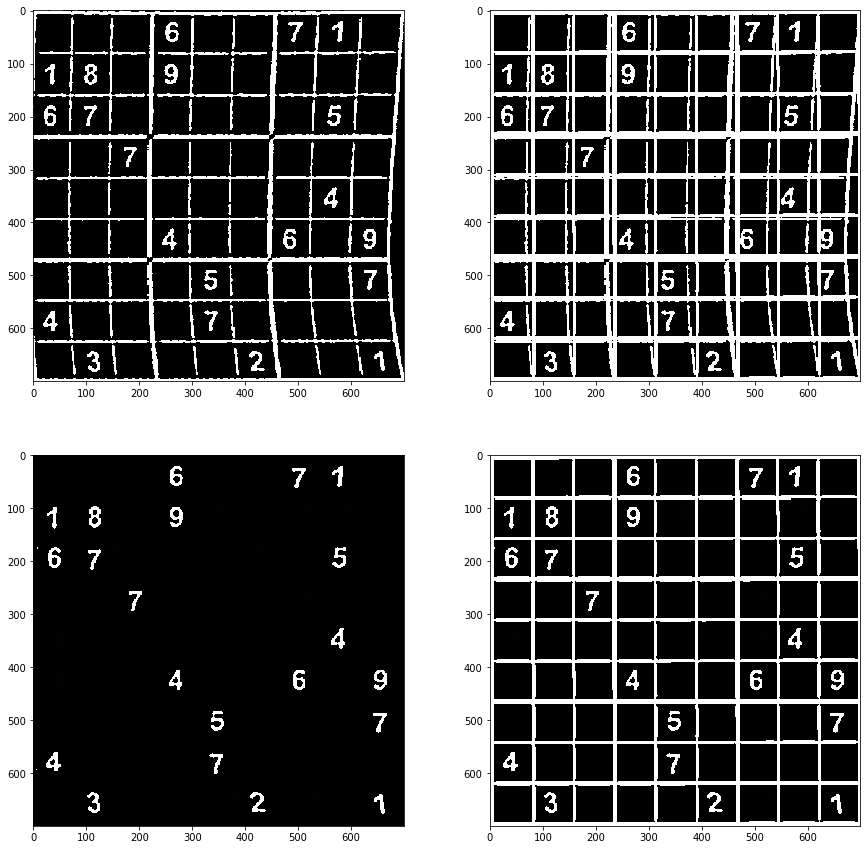

# Sudoku Scan

Dette har vært mitt sommerprosjekt 2020 og var et naturlig valg fordi det kombinerer digital bildebehandling og maskinlæring. 

Jeg begynte med en Python-prototype i Jupyter Notebook for å lage en proof of concept, og for å utforske OpenCV her.

Deretter prøvde jeg å overføre denne kunnskapen over til Flutter, slik at appen kunne publiseres både hos iOS og Android med samme kodebase. Dessverre støtte jeg på problemer når det kom til bildegjennkjenning.

Derfor byttet jeg ut Flutter med Swift. Med dette kunne jeg benytte de verktøyene jeg hadde bruk for, på bekostning av å kun kunne publisere til iOS.

På grunn av skiftet fra Flutter til Swift ble prosjektet mer omfattende og er dermed noe jeg fremdeles utvikler på siden av studiene.

## Mål

Jeg har laget en skisse i Adobe XD for å lettere visualisere hvordan det endelige resultatet er ment å se ut.
Her er en enkel GIF til demonstasjon:

  

Foreløpig er selve sudokubrettet i skissen tilnærmet en blåkopi av appen fra Sudoku.com, bortsett fra små endringer i ikonene og plasseringer. Dette er gjort for å raskere få på plass noe som ser riktig ut, uten å bruke for mye tid på å finne opp kruttet på nytt. 

## Prototyping
Jeg prototyper som nevnt i Python i Jupyter Notebook. Her leker jeg meg masse med spennende funksjoner i OpenCV. I bildet under kan man se resulatet etter bildebehandlingen for å hente ut brettet.

Det originale bildet:

  

Forklaring til prosesseringen min:
1. Finne det største rektanglet i bildet. Vi kan anta at dette er sudokubrettet.
2. Vri denne firkanten slik at den blir et kvadrat i 2D-plan. (Bildet øverst til venstre)
3. På bildet øverst til høyre har jeg lagt over et perfekt inndelt rutenett. Her ser vi at rutene ikke samsvarer siden arket bildet ble tatt av ikke var flatt.
4. Jeg går over og fjerner rutenettet. For å finne den beste metoden til dette har vært en veldig kreativ prosess for å et stabilt resulat uavhengig om bildet er tatt bra eller ikke.
5. Når rutenettet er fjernet, går jeg over bildet og sentrerer alle tallene slik at de står midt i sin rute. Dette er for å rette opp et bilde tatt på et ikke-flatt ark. Dette kan vi se resulatet av i bildet nederst til venstre. I dette steget lagres også posisjonen til alle tall, slik at de lett kan hentes senere.
6. Kun som demonstrasjon legger jeg over det samme perfekte rutenettet fra punkt 3. Nå kan vi se at tallene er rettet opp og at de er sentrert midt i sin respektive rute.

Det prosesserte bildet i 4 steg:

  

Nå er alt klart for å bruke den lagrede posisjonen til alle tallene fra steg 5. Disse blir analysert med en OCR for å tyde hvilket tall det er. 
Når alle tallene er tolket mates denne inn i en backtracking-algoritme for å løse spillet.
